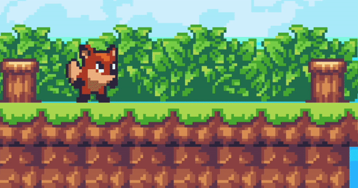
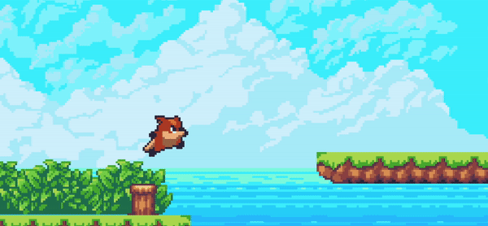
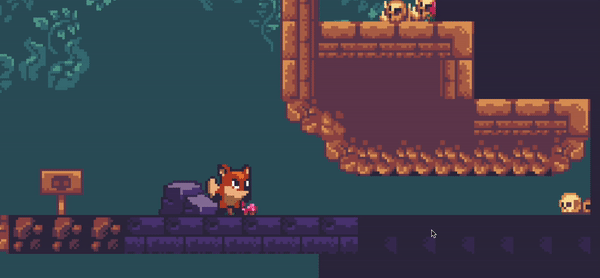
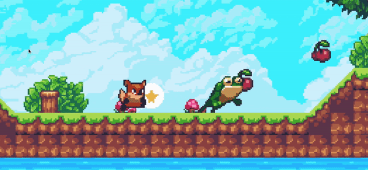
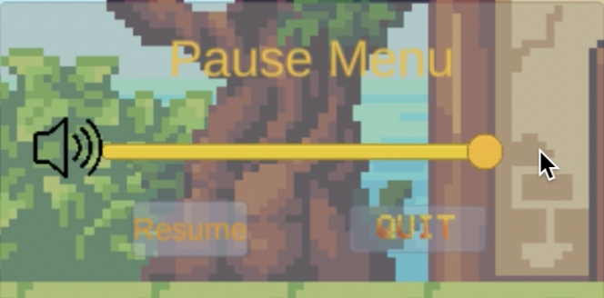
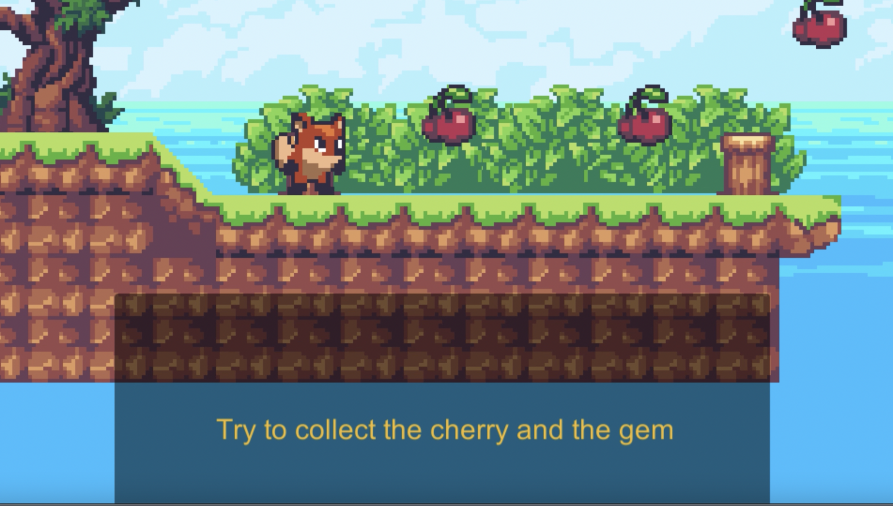
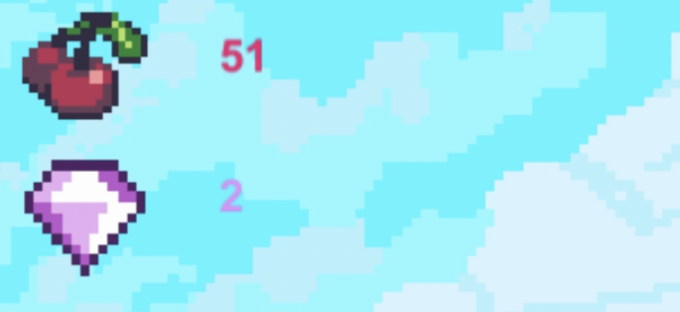
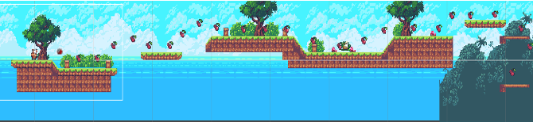
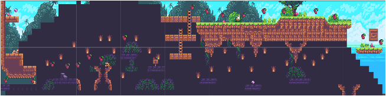

# Sunny-Land

## Introduction

Sunny Land is a mini horizontal Parkour game implemented with Unity. In this game, the player plays a little fox to explore the forest, pick up items and beat enemies.

This is my first game. I developed this game independently under [a series of online tutorials](https://space.bilibili.com/370283072/channel/collectiondetail?sid=2991) for the selection exam of the international summer school organized by the University of Bologna in 2020.

## Features 

1. In this game, the player can take three kinds of action: running, jumping, and crouching. 

   - Running

     

   - Jumping

     

   - Crouching

     

2. The player can pick up cherries and beat enemies by jumping on them.

   

3. This game has various UI designs like menus, popping hints, and collection information.

   - Menus

     

     

      

   - Popping hints 

     

   - Collection Information

     

4. This game has two different scenes (day and night).

   

   

## Demo Video

[demo](https://www.youtube.com/watch?v=A_twmaDyGqw)

## Install

Windows: [Sunny Land](./install/Windows)

Mac: [Sunny Land](./install/Mac)

